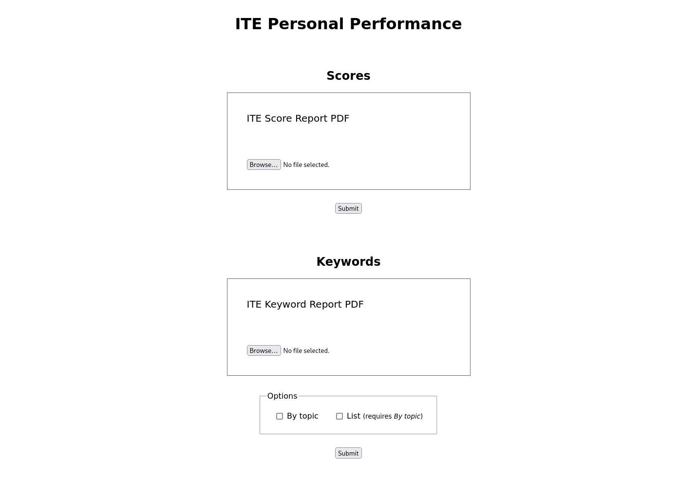

# ITE Personal Performance Web Interface

A simple web interface for the two binary tools. Select the
corresponding input file, press submit, and receive the output.



## Building

Requires built binaries for `x86_64-unknown-linux-musl` target to be added to the
`lib` directory:

```
lib
├── ite-personal-keywords
└── ite-personal-scores
```

The [`pdftotext`](https://github.com/jalan/pdftotext) package is vendored here
because we hijack its `setup.py` to install system dependencies for the
lambdas. Vercel doesn't seem to give us any other way aside from making our own
python runtime.

After committing those atrocities, we literally just shell out to the rust
binaries to perform the extractions. This whole web interface is both
disgusting and amazing.
